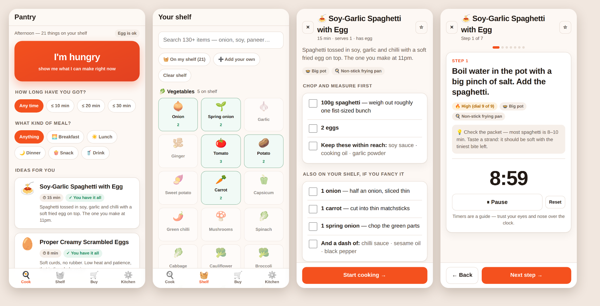

# Pantry — what can I cook?

Log what's actually on your shelf. Press **I'm hungry**. Get two or three things you can
cook *right now*, with the pan to use, the number to turn your induction to, timed steps,
and prep amounts — written for someone who is still learning to cook.

Built for one person cooking for themselves on an induction hob with a couple of pans.



## What it does

- **A visual shelf.** 130+ food items across 14 shelves — vegetables, sauces, spices,
  seeds, dairy, dals, tins, freezer. Tap what you have and set how many. Counted things
  (onions, eggs, bread) hold a number; jars and bottles (soy sauce, turmeric, oil) are
  just Have / Low / Out, because nobody measures their turmeric.
- **One button.** *I'm hungry* ranks every recipe against your shelf: things you can make
  with nothing missing come first, then things you're one or two items short of. Press it
  again for different ideas.
- **Cook mode.** Prep list first (*"1 onion — chop small"*, scaled to how many you're
  feeding), then one big step at a time with a live timer you can start, pause and reset.
  It chimes and buzzes when the timer runs out, and keeps the screen awake while you cook.
- **Heat in your hob's numbers.** Steps say *"Medium (dial 5 of 9)"* — set your dial's
  maximum once on the Kitchen tab and every recipe speaks in your numbers. Watts too.
- **Your pans.** Tell it what you own; a recipe that wants a kadai will tell you to use
  your frying pan instead, and says so on every step.
- **It ticks itself off.** After cooking, tap *yes* and it subtracts what you used from
  your shelf. Missing something? Add it to the buy list; tick it off when you buy it and
  it lands back on the shelf.
- **Works with no signal.** It's a PWA: add it to your home screen and it opens like an
  app, offline, with everything cached.

35 recipes are built in — eggs, pasta, rice, noodles, dal, sabzi, toast, oats, soup,
sandwiches, a few with chicken — all 3–30 minutes and all beginner-proof.

## Run it

No build step, no dependencies, no server. Any static file server will do:

```bash
python3 -m http.server 8080
# then open http://localhost:8080
```

(Open `index.html` straight off disk and ES modules and the service worker are blocked by
the browser, so use a server — even a local one.)

**On your phone:** put these files on any static host (GitHub Pages works — push this
branch and turn on Pages for the repo root), open the URL, then *Add to Home Screen*.
After the first load it runs offline.

## Your data

Everything is in `localStorage` on the device. No account, no server, nothing uploaded.
**Kitchen → Save a backup** writes a JSON file you can restore later or move to a new phone.

## Optional: let Claude invent recipes

The 35 built-in recipes cover the common combinations, but your shelf is infinite. Add an
[Anthropic API key](https://console.anthropic.com) on the Kitchen tab and an extra button
appears under the ideas: **Ask Claude for something new**. It sends your shelf, your pans,
your hob and your time limit, and gets back 2–3 fresh recipes in the same format — so they
open in the same cook mode, with the same timers, and are saved to the device.

It calls the Messages API straight from the browser (`claude-opus-5`, JSON-schema
structured output, so the ingredient ids always match your shelf). Your key is kept only
in this browser's `localStorage` and sent only to `api.anthropic.com`. That's fine for a
personal app on your own phone. If you ever host this for other people, put a small proxy
in front and keep the key on the server instead — a key in a browser is a key anyone using
that browser can read.

Everything else keeps working with no key and no connection.

## Adding your own recipes

`js/data/recipes.js` is the whole library — plain objects, no build step. Copy one and edit:

```js
{
  id: 'my_dinner', name: 'Whatever I Make', emoji: '🍲',
  blurb: 'One line on why this is worth making.',
  mins: 15, serves: 1, meal: ['dinner'], diet: 'egg',   // vegan | veg | egg | meat
  cookware: ['nonstick_pan'],                            // ids from js/data/cookware.js
  need: [                                                // must-haves
    { id: 'egg', q: 2, prep: 'beat with a pinch of salt' },
    { id: 'onion', q: 1, alt: ['spring_onion'], prep: 'chop small' },
    { id: 'soy_sauce' },                                 // jars need no quantity
  ],
  opt: [{ id: 'chilli_flakes', use: 'on top at the end' }],  // nice-to-haves
  steps: [
    { do: 'Heat the pan.', heat: 'medium', t: 90, tip: 'The thing beginners get wrong.' },
  ],
  serve: 'How to eat it.',
}
```

`q` is in that item's own unit from `js/data/catalog.js` (pieces, grams, ml). `heat` is
`low | medium | mhigh | high | off` and is translated into your hob's dial numbers.
`t` is seconds and becomes a timer. Quantities are per `serves` and get scaled.

New ingredient? Add a row to `RAW` in `js/data/catalog.js`. Or add one from the app:
**Shelf → Add your own** (yours won't match the built-in recipes, but Claude will use them).

## How the matching works

`js/match.js` scores every recipe against the shelf: each `need` item must be present in
enough quantity (or one of its `alt` swaps must be), jars just need to not be Out.
Recipes you have everything for rank first, then ones missing one item, then two. Owning
more of the `opt` items pushes a recipe up; something you cooked in the last few days
drops down; a small per-press random nudge means the button gives you something different
each time.

## Layout

```
index.html            shell: header, screen, tab bar
css/app.css           one stylesheet, light + dark, phone first
js/app.js             boot, tabs, history
js/store.js           state + localStorage (the only place data is written)
js/match.js           shelf -> ranked recipe ideas
js/ai.js              optional Claude call
js/data/catalog.js    the 134-item food library
js/data/recipes.js    the 35 recipes
js/data/cookware.js   pans, and heat level -> your dial number
js/views/             home · shelf · buy · kitchen · cook
sw.js                 offline cache (bump CACHE when you change a file)
```

Vanilla JS modules, no framework and no toolchain, so it still runs in five years.
